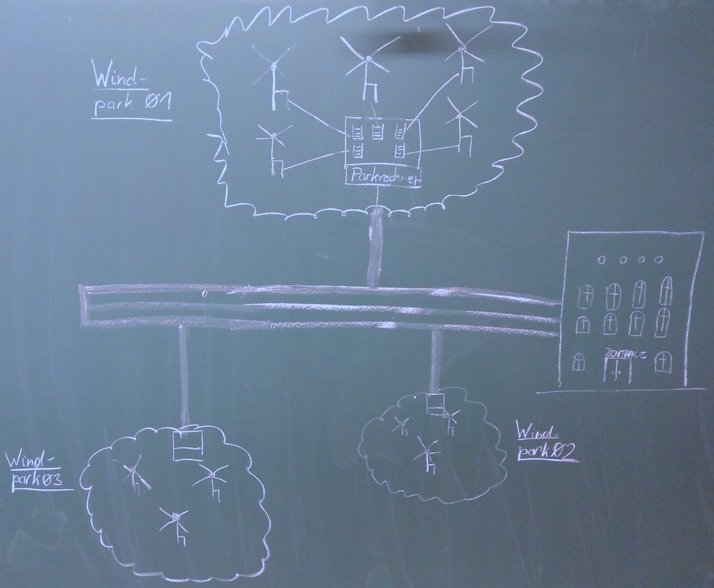

# DEZSYS_GK772_WINDPARK_MOM
Join GIT repository: https://classroom.github.com/a/EgpwdiJu

## Einführung

Diese Übung soll die Funktionsweise und Implementierung von eine Message Oriented Middleware (MOM) mit Hilfe des **Frameworks Apache Active MQ** demonstrieren. **Message Oriented Middleware (MOM)** ist neben InterProcessCommunication (IPC), Remote Objects (RMI) und Remote Procedure Call (RPC) eine weitere Möglichkeit um eine Kommunikation zwischen mehreren Rechnern umzusetzen.

Die Umsetzung basiert auf einem praxisnahen Beispiel einer Windkraftanalage. Ein Windkraftanalage (Windrad) ist immer Teil eines Verbunds, genannt Windpark. Jede Windkraftanlage beinhaltet einen Rechner, der die Daten der Windkraftanalage aufzeichnet und diese steuern kann. Die Daten werden als REST Schnittstelle in XML oder JSON zur Verfügung gestellt. Die Daten aller Windkraftanlagen eines Windparks werden von einem Parkrechner gesammelt und abgespeichert. Der Parkrechner kommuniziert mit dem Rechenzentrum in der Zentrale. Eine Zentrale kommuniziert mit mehreren Windparks und steuert diese.

## 1.1 Ziele  

Das Ziel dieser Übung ist die **Implementierung einer Kommunikationsplattform für einen Windpark. Dabei erfolgt ein Datenaustausch von mehreren Windkraftanlage mit dem Parkrechner unter Verwendung einer Message Oriented Middleware (MOM)**. Die einzelnen Daten der Windkraftanlage sollen an den Parkrechner übertragen werden. Es sollen **nachrichtenbasierten Protokolle mit Message Queues** verwendet werden. Durch diese lose Kopplung kann gewährleistet werden, dass in Zukunft weitere Anlagen hinzugefügt bzw. Kooperationspartner eingebunden werden können.

Neben der REST-Schnittstelle muss nun eine Schnittstelle bei der Windkraftanlage implementiert werden, die in regelmässigen Abständen die Daten von der REST-Schnittstelle ausliest und diese in eine Message Queue von **Apache Active MQ** hinzufügt. Um die Datenintegrität zu garantieren, sollen jene Daten, die mit der Middleware übertragen werden in einer LOG-Datei abgespeichert werden.  

## 1.2 Voraussetzungen

*   Grundlagen Architektur von verteilten Systemen
*   Grundlagen zur nachrichtenbasierten Systemen / Message Oriented Middleware  
*   Verwendung des Message Brokers Apache ActiveMQ
*   Verwendung der XML- oder JSON Datenstruktur der Windkraftanlage
*   Verwendung der Demo-Applikation MOMApplication (inklusive MOMReceiver und MOMSender) (siehe Repo)
*   Verwendung von

## 1.3 Aufgabenstellung

Implementieren Sie die Windpark-Kommunikationsplattform mit Hilfe des Java Message Service. Verwenden Sie Apache ActiveMQ ([http://activemq.apache.org](http://activemq.apache.org/)) als Message Broker Ihrer Applikation. Das Programm soll folgende Funktionen beinhalten:

 *   Installation von Apache ActiveMQ am Parkrechner.
 *   Jede Windkraftanlage erstellt eine Message Queue mit einer ID am Parkrechner.
 *   Jede Windkraftanlage legt in regelmässigen Abständen die Daten der Anlage in der Message Queue ab.
 *   Bei einer erfolgreichen Übertragung empfängt die Windkraftanlage die Nachricht "SUCCESS".
 *   Der Parkrechner fragt in regelmässigen Abständen alle Message Queues ab.
 *   Der Parkrechner fuegt alle Daten aller Windkraftanlagen zusammen und stellt diese an einer REST Schnittstelle im JSON/XML Format zur Verfügung.

## 1.4 Demo Applikation

*   Starten des Message Broker Apache Activemq  
		`[Installationsverzeichnis Apache Activemq]/bin/activemq start`

*   Administration von Apache Activemq via Webinterface  
		[http://localhost:8161/admin](http://localhost:8161/admin)  
                  `Username: admin, Password: admin`   

### 1.4.1 windpark_demo1

Demo 1 beinhaltet eine Implementierung, die alle Einzelschritte zur Implementierung von Java und JMS beinhaltet und uebersichtlich darstellt. Die JMS Teile Sender und Empfaenger werden einzeln aufgerufen.

 *   Starten des Empfaengers MOMReceiver  
     `mvn clean spring-boot:run -Dspring-boot.run.arguments=receiver`    
      `-OR-`   
     `gradle clean bootRun -Pargs=receiver`

 *   Starten des Sender MOMSender  
     `mvn clean spring-boot:run -Dspring-boot.run.arguments=sender`   
     `-OR-`   
     `gradle clean bootRun -Pargs=sender`

### 1.4.2 windpark_demo2

Demo 2 beinhaltet eine Implementierung, die eine Umsetzung von JMS mit Springboot darstellt und aktuelle Bibliotheken und Annotation beinhaltet. Der Sender wird als REST Controller aufgerufen und der Empfaenger wird mittels einem Listener umgesetzt.

*   Starten der Applikation  
    `mvn clean spring-boot:run`   
    `-OR-`    
    `gradle clean bootRun`

*   Aufruf des Senders mittels Postman  
     Laden Sie in [Postman](https://www.postman.com) die Datei windpark_demo2.postman_collection.json und senden
		 Sie den vorbereiteten HTTP POST Request.

## 1.5 Bewertung  

*   Gruppengrösse: 1 Person
*   Abgabemodus: per Protokoll, bei EK kann ein Abgabegespraech erforderlich sein
*   Anforderungen **"überwiegend erfüllt"**
    *   Implementierung der Kommunikation zwischen **EINER** Windkraftanlage und dem Parkrechner (JMS Queue)  
    *   Ausgabe der empfangenen Daten am Parkrechner (Konsole oder Log-Datei)
    *   Beantwortung der Fragestellungen   
*   Anforderungen **"zur Gänze erfüllt"**
    *   Temporaeres Speichern der Daten am Parkrechner zur Laufzeit (neue Datensaetze sollten immer angefuegt werden)
    *   Zusammensetzung der Daten aller Windkraftanlagen in eine zentrale JSON/XML-Struktur
    *   Implementierung der REST Schnittstelle am Parkrechner
*  Erweiterte Anforderungen **überwiegend erfüllt**
    *   Implementierung der Kommunikation mit **MEHREREN** Windkraftanlage und dem Parkrechner
    *   Logging der Daten bei allen Windkraftanlagen und dem Parkrechner   
*  Erweiterte Anforderungen **zur Gänze erfüllt**
    *   Rückmeldung des Ergebnisses der Übertragung vom Parkrechner an die Windkraftanlage (JMS Topic)  

## 1.6 Fragestellung für Protokoll

*   Nennen Sie mindestens 4 Eigenschaften der Message Oriented Middleware?  
*   Was versteht man unter einer transienten und synchronen Kommunikation?
*   Beschreiben Sie die Funktionsweise einer JMS Queue?
*   JMS Overview - Beschreiben Sie die wichtigsten JMS Klassen und deren Zusammenhang?
*   Beschreiben Sie die Funktionsweise eines JMS Topic?
*   Was versteht man unter einem lose gekoppelten verteilten System? Nennen Sie ein Beispiel dazu. Warum spricht man hier von lose?
`
## 1.6 Links & Dokumente

*   Grundlagen Message Oriented Middleware: [Presentation](https://elearning.tgm.ac.at/pluginfile.php/225789/mod_resource/content/1/dezsys_mom_einfuehrung.pdf)
*   Middleware:  
  [Apache ActiveMQ Installationspaket](http://activemq.apache.org/components/classic/download/)  
*   Apache ActiveMQ & JMS Tutorial:   
  http://activemq.apache.org/components/classic/documentation  
  https://spring.io/guides/gs/messaging-jms/  
  https://medium.com/@mailshine/activemq-getting-started-with-springboot-a0c3c960356e   
  http://www.academictutorials.com/jms/jms-introduction.asp   
  http://docs.oracle.com/javaee/1.4/tutorial/doc/JMS.html#wp84181    
  https://www.oracle.com/java/technologies/java-message-service.html   
  http://www.oracle.com/technetwork/articles/java/introjms-1577110.html  
  https://spring.io/guides/gs/messaging-jms  
  https://docs.spring.io/spring-boot/docs/current/reference/html/boot-features-messaging.html  
  https://dzone.com/articles/using-jms-in-spring-boot-1  
